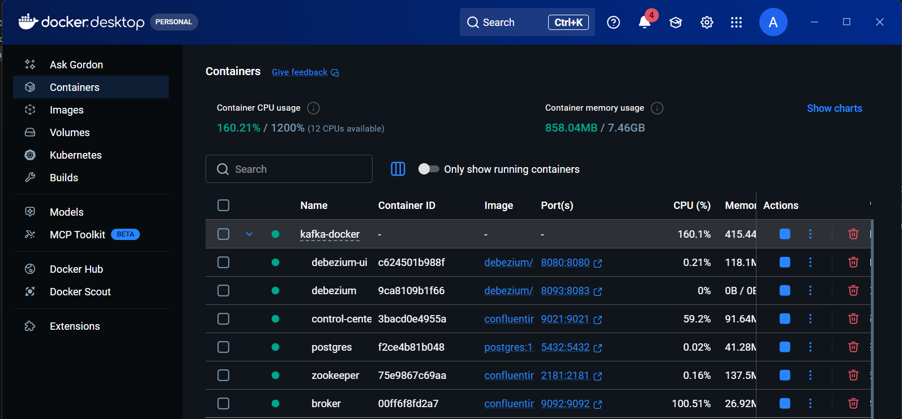
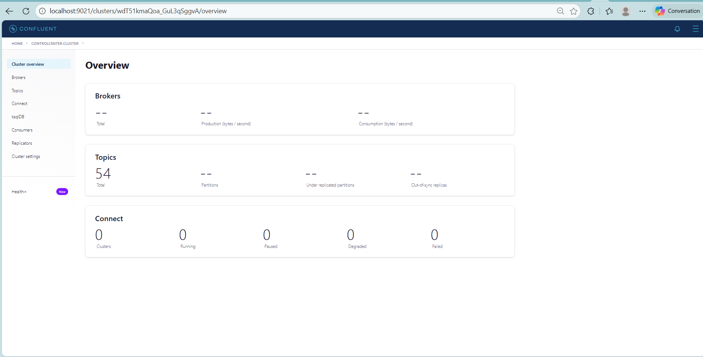

# 📘 Documentation – Dockerisation de la Plateforme Kafka & Debezium

## 1. 🎯 Objectif

Dockeriser l’environnement de **streaming** et **CDC** du projet **Data Lakehouse** afin de :

- standardiser l’environnement  
- faciliter le démarrage rapide  
- éviter les problèmes d’installation manuelle  
- garantir la **reproductibilité** totale  

La solution repose sur **Docker Compose** pour orchestrer l’ensemble des services.

## 2. 🧩 Architecture déployée

| Service              | Rôle                                          | Image utilisée                                      | Ports exposés (host → container) |
|----------------------|-----------------------------------------------|-----------------------------------------------------|----------------------------------|
| Zookeeper            | Coordination du cluster Kafka                 | `confluentinc/cp-zookeeper:7.4.0`                   | 2181                             |
| Kafka Broker         | Message broker principal                      | `confluentinc/cp-kafka:7.4.0`                       | 9092, 29092, 9101                |
| Control Center       | Interface de monitoring Kafka                 | `confluentinc/cp-enterprise-control-center:7.4.0`   | 9021                             |
| Debezium Connect     | Capture CDC → publication vers Kafka          | `debezium/connect:2.4`                              | 8093 → 8083                      |
| Debezium UI          | Interface graphique de gestion des connecteurs| `debezium/debezium-ui:2.4`                          | 8080                             |

**Réseau commun** : `biat-it-net`  
Tous les services communiquent entre eux via leur hostname sur ce réseau Docker.

## 3. ⚙️ Prérequis

- **Docker Desktop** (Windows / Mac) ou **Docker Engine** (Linux)  
- **Docker Compose v2** (inclus dans les versions récentes de Docker)  

**Configuration recommandée** :

- RAM ≥ **8 Go**  
- Disque libre ≥ **10 Go**

### Vérification rapide

```bash
docker --version
docker compose version
```

### 4. 📄 Fichier docker-compose.yaml (extrait principal)

```yaml
networks:
  biat-it-net:
    name: biat-it-net

services:
  zookeeper:
    image: confluentinc/cp-zookeeper:7.4.0
    container_name: zookeeper
    ports:
      - "2181:2181"
    environment:
      ZOOKEEPER_CLIENT_PORT: 2181
      ZOOKEEPER_TICK_TIME: 2000

  broker:
    image: confluentinc/cp-kafka:7.4.0
    container_name: broker
    depends_on:
      - zookeeper
    ports:
      - "9092:9092"
      - "29092:29092"
      - "9101:9101"
    environment:
      KAFKA_BROKER_ID: 1
      KAFKA_ZOOKEEPER_CONNECT: 'zookeeper:2181'
      KAFKA_LISTENER_SECURITY_PROTOCOL_MAP: PLAINTEXT:PLAINTEXT,PLAINTEXT_HOST:PLAINTEXT
      KAFKA_ADVERTISED_LISTENERS: PLAINTEXT://broker:29092,PLAINTEXT_HOST://localhost:9092
      KAFKA_OFFSETS_TOPIC_REPLICATION_FACTOR: 1
      KAFKA_GROUP_INITIAL_REBALANCE_DELAY_MS: 0
      KAFKA_TRANSACTION_STATE_LOG_MIN_ISR: 1
      KAFKA_TRANSACTION_STATE_LOG_REPLICATION_FACTOR: 1
      KAFKA_AUTO_CREATE_TOPICS_ENABLE: 'true'

  control-center:
    image: confluentinc/cp-enterprise-control-center:7.4.0
    container_name: control-center
    depends_on:
      - broker
    ports:
      - "9021:9021"
    environment:
      CONTROL_CENTER_BOOTSTRAP_SERVERS: 'broker:29092'
      CONTROL_CENTER_REPLICATION_FACTOR: 1
      CONTROL_CENTER_INTERNAL_TOPICS_PARTITIONS: 1
      CONTROL_CENTER_MONITORING_INTERCEPTOR_TOPIC_REPLICATION: 1

  connect:
    image: debezium/connect:2.4
    container_name: connect
    depends_on:
      - broker
    ports:
      - "8093:8083"
    environment:
      BOOTSTRAP_SERVERS: broker:29092
      GROUP_ID: 1
      CONFIG_STORAGE_TOPIC: connect_configs
      OFFSET_STORAGE_TOPIC: connect_offsets
      STATUS_STORAGE_TOPIC: connect_statuses
      KEY_CONVERTER: org.apache.kafka.connect.json.JsonConverter
      VALUE_CONVERTER: org.apache.kafka.connect.json.JsonConverter
      ENABLE_DEBEZIUM_SCRIPTING: "true"

  debezium-ui:
    image: debezium/debezium-ui:2.4
    container_name: debezium-ui
    depends_on:
      - connect
    ports:
      - "8080:8080"

```

## 5. ▶️ Démarrage de la plateforme

Depuis le dossier qui contient le fichier `docker-compose.yaml`, exécutez la commande suivante :

```bash
docker compose up -d
```

### Explications de la commande

- `docker compose` : utilise Docker Compose v2 (la syntaxe moderne, recommandée depuis 2021–2022)
- `up` : crée (si nécessaire) et démarre tous les conteneurs définis dans le fichier `docker-compose.yaml`
- `-d` : mode **détaché** (detached) → les conteneurs tournent en arrière-plan, le terminal est libéré immédiatement (sinon il reste bloqué sur les logs)

### Ce qui se passe quand on lance cette commande

1. Docker Compose lit le fichier `docker-compose.yaml`
2. Il crée le réseau `biat-it-net` (s’il n’existe pas déjà)
3. Il vérifie si les images existent localement ; sinon il les télécharge automatiquement (`pull`) :
   - `confluentinc/cp-zookeeper:7.4.0`
   - `confluentinc/cp-kafka:7.4.0`
   - `confluentinc/cp-enterprise-control-center:7.4.0`
   - `debezium/connect:2.4`
   - `debezium/debezium-ui:2.4`
4. Il crée un conteneur par service
5. Il applique :
   - les mappings de ports
   - les variables d’environnement
   - les dépendances (`depends_on`)
   - la connexion au réseau `biat-it-net`
6. Il démarre les conteneurs dans l’ordre respectant les dépendances
7. Les healthchecks (s’ils sont définis dans le compose) commencent à s’exécuter pour valider que chaque service est réellement opérationnel

### Vérification via Docker Desktop


## 8. ✅ Vérifications fonctionnelles

Une fois la stack démarrée, vérifiez que tout fonctionne correctement en accédant aux interfaces et ports exposés :

| Interface            | URL                          | Description                                      |
|----------------------|------------------------------|--------------------------------------------------|
| Control Center       | http://localhost:9021        | Monitoring Kafka : visualisation des topics, brokers, consumers, producers, lag… |
| Debezium UI          | http://localhost:8080        | Interface graphique pour créer, modifier et gérer les connecteurs CDC (Change Data Capture) |
| Kafka Broker         | localhost:9092               | Port principal Kafka accessible depuis l’hôte pour connecter des producers ou consumers (ex. via kafkacat, kcat, console-producer, etc.) |

### Conseils rapides de vérification
- Ouvrez **http://localhost:9021** dans votre navigateur → si la page s’affiche et montre le cluster Kafka avec 1 broker → OK


- Ouvrez **http://localhost:8080** → si l’interface Debezium UI apparaît (liste des connecteurs vide au début) → OK


## 9. 🧪 Commandes utiles

```bash
# Voir tous les conteneurs actifs (avec leur statut, ports, noms…)
docker ps

# Voir les logs en temps réel (suivi live, très pratique au démarrage ou pour debugger)
docker compose logs -f

# Arrêter la stack et supprimer les conteneurs (les volumes et données persistantes sont conservés par défaut)
docker compose down

# Arrêter la stack + supprimer aussi les volumes (nettoyage complet, utile pour repartir de zéro)
docker compose down -v

# Nettoyage global du système Docker (supprime images non utilisées, conteneurs arrêtés, volumes orphelins, cache build…)
# Attention : cette commande est puissante et libère souvent plusieurs Go d'espace disque
docker system prune -a --volumes
```

## 10. 🚨 Problèmes fréquents & solutions

| Problème                        | Cause probable                        | Solution rapide                                      |
|---------------------------------|----------------------------------------|------------------------------------------------------|
| Disque à 100 %                  | Images Docker lourdes + logs accumulés | `docker system prune -a --volumes`                   |
| Port déjà utilisé               | 9021, 8080, 9092, 8093… occupés        | Changer le mapping dans `docker-compose.yaml` OU stopper le service/processus en conflit |
| Control Center ne démarre pas   | Broker pas healthy / pas encore prêt   | `docker compose logs broker` → attendre 1–2 min OU redémarrer la stack |
| Debezium Connect inaccessible   | Dépendances non résolues / mauvaise config | `docker compose logs connect` → vérifier `BOOTSTRAP_SERVERS` et topics internes |
| Connecteur ne se crée pas       | Mauvaise config JSON / erreur de validation | Tester la config via Debezium UI OU via curl :<br>`curl -X POST -H "Content-Type: application/json" --data @connector.json http://localhost:8093/connectors` |